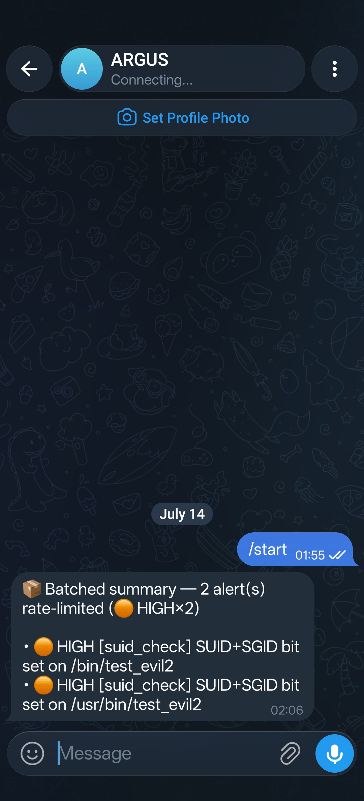

# ARGUS

> **The watcher that never sleeps.**
> Real-time Linux privilege escalation detection and alerting.

**Author:** Mostafa Tamime

[](https://www.python.org/)
[](LICENSE)
[](#)

---

## The Problem

Privilege escalation vectors on Linux servers — misconfigured SUID binaries,
injected cron jobs, tampered sudoers policies, capability grants — often sit
undetected for hours or days after they appear. Manual enumeration tools like
linPEAS require an operator to deliberately run them; by the time they do, an
attacker may already have moved laterally or established persistence. ARGUS
watches continuously and alerts the moment system state changes.

---

## Why ARGUS is not linPEAS

|  | linPEAS | ARGUS |
|---|---|---|
| **Mode** | One-shot, run manually | Continuous background daemon |
| **Trigger** | Operator initiates | Always-on, automatic |
| **Alerting** | None — prints to terminal | Real-time Telegram messages |
| **Noise / dedup** | Re-reports everything on every run | SQLite baseline; alerts only on *new* state |
| **Purpose** | Offensive enumeration aid | Blue team defensive monitor |

---

## Features

- **SUID/SGID binary detection** — inventories setuid/setgid files across
  common binary paths every N seconds; alerts HIGH on new entries, LOW when
  one disappears (cleared or binary removed)
- **Sudoers real-time monitoring** — watchdog-driven; detects `/etc/sudoers`
  and `/etc/sudoers.d/` changes the moment they are written, with a unified
  content diff in the alert body
- **Cron job monitoring** — same mechanism for `/etc/crontab`, `/etc/cron.d/`,
  and `/var/spool/cron/` (recursive)
- **Telegram alerting** with per-severity emoji (🔴 CRITICAL / 🟠 HIGH /
  🟡 MEDIUM / 🟢 LOW), configurable per-minute rate limit, and automatic
  overflow batching into summary messages when the cap is hit
- **SQLite baseline + diff deduplication** — each finding is hashed; only
  genuinely new state fires an alert; the same binary or file change never
  spams you twice
- **`--dry-run` mode** — full detection pipeline and SQLite logging, zero
  outbound Telegram calls; safe for testing on production hosts
- **Rotating log file** — configurable size and backup count; always-on,
  independent of Telegram availability

---

## Architecture

```
┌─────────────────────────────────────────────────────────────┐
│                         main.py                             │
│                                                             │
│  asyncio.run(run_daemon)                                    │
│  ├── poll_loop  (every scan_interval_seconds)               │
│  │    └── SuidCheckDetector.run_once()                      │
│  │                                                          │
│  ├── watch_drain_loop  (every 1 s, drains pending queue)    │
│  │    ├── SudoersCheckDetector.run_once()                   │
│  │    └── CronCheckDetector.run_once()                      │
│  │                                                          │
│  └── deferred_flush_loop  (every 15 s)                      │
│       └── TelegramBot.flush_deferred()                      │
└──────────────────┬──────────────────────────────────────────┘
                   │ detector.run_once()
                   ▼
┌──────────────────────────┐    ┌─────────────────────────────┐
│  BaseDetector            │    │  storage/db.py              │
│  scan()                  │    │                             │
│  diff(baseline, current) │◄───│  baselines table            │
│  save_baseline(current)  │───►│  (detector_name, item_hash, │
└──────────────┬───────────┘    │   first_seen, last_seen)    │
               │ novel findings  └─────────────────────────────┘
               ▼
┌──────────────────────────┐    ┌─────────────────────────────┐
│  emit_findings()         │───►│  alerts table               │
│  log_finding()           │    │  (id, timestamp, detector,  │
│  persist_findings()      │    │   severity, message,        │
│  bot.notify()            │    │   acknowledged)             │
└──────────────┬───────────┘    └─────────────────────────────┘
               │
               ▼
┌──────────────────────────┐
│  alerts/telegram_bot.py  │
│  format_alert()          │
│  rate-limit window       │
│  POST /sendMessage API   │
└──────────────────────────┘
```

---

## Screenshots

**Daemon startup — ARGUS banner and detector registration**


**Log output — detection events, Telegram dispatch, and graceful shutdown**


**Telegram alert — batched rate-limited HIGH findings**



---

## Installation

```bash
git clone https://github.com/your-handle/argus.git
cd argus
python3 -m venv .venv
source .venv/bin/activate      # Windows: .venv\Scripts\activate
pip install -r requirements.txt
```

> **Requirements:** Python 3.11+, Linux target host.
> For capability scanning: `apt install libcap2-bin` (Debian/Ubuntu) or
> `dnf install libcap` (RHEL/Fedora).
> For auditd event parsing: auditd must be running and loaded with the
> rule keys listed in the [Recommended auditd Rules](#recommended-auditd-rules)
> section below.

---

## Configuration

Copy the example config and fill in your values:

```bash
cp config.example.yaml config.yaml
```

> **⚠️ Never commit `config.yaml`** — it holds your Telegram bot token.
> The file is listed in `.gitignore`. Only `config.example.yaml` is tracked.

### Telegram setup

1. Message [@BotFather](https://t.me/BotFather) on Telegram → `/newbot` →
   copy the token it gives you.
2. Start a conversation with your new bot (send it any message), or add it
   to a private channel.
3. Retrieve your `chat_id`:
   ```bash
   curl "https://api.telegram.org/bot<TOKEN>/getUpdates"
   ```
   Look for `"chat":{"id": <number>}` in the JSON response.
4. In `config.yaml`, set `telegram.enabled: true` and paste both values.

### Key config options

| Key | Default | Description |
|---|---|---|
| `daemon.scan_interval_seconds` | `60` | Polling interval for SUID/capability scans |
| `daemon.db_path` | `privesc_monitor.db` | SQLite file location |
| `telegram.enabled` | `false` | Set `true` to activate Telegram alerts |
| `telegram.max_alerts_per_minute` | `10` | Rate-limit cap; overflow is batched into a summary |
| `detectors.enabled` | list | Which detectors to activate (see `config.example.yaml`) |
| `logging.file` | `logs/privesc_monitor.log` | Rotating log file path |
| `logging.max_bytes` | `1048576` | Max log file size before rotation (1 MB) |
| `logging.backup_count` | `5` | Number of rotated log files to keep |

---

## Usage

```bash
# Full daemon — detection + SQLite logging + Telegram alerts
python main.py -c config.yaml

# Dry-run — detection and SQLite logging only, no Telegram messages sent
python main.py --dry-run -c config.yaml

# Verbose DEBUG output to console and log file
python main.py -v -c config.yaml
```

---

## Recommended auditd Rules

Add to `/etc/audit/rules.d/argus.rules` and reload with `augenrules --load`:

```
# Privilege escalation to root
-a always,exit -F arch=b64 -S execve -F euid=0 -F auid>=1000 -k priv_esc_root

# Sudoers changes
-w /etc/sudoers -p wa -k sudoers_change
-w /etc/sudoers.d/ -p wa -k sudoers_change

# Cron changes
-w /etc/crontab -p wa -k cron_change
-w /etc/cron.d/ -p wa -k cron_change
-w /var/spool/cron/ -p wa -k cron_change

# SUID/SGID bit changes
-a always,exit -F arch=b64 -S chmod -S fchmod -S fchmodat -k suid_change

# Capability grants
-a always,exit -F arch=b64 -S capset -k capset_usage

# UID changes
-a always,exit -F arch=b64 -S setuid -S setreuid -S setresuid -k uid_change

# Kernel module insertion
-a always,exit -F arch=b64 -S init_module -S finit_module -k module_insertion
```

---

## Roadmap

### Implemented and enabled by default

- [x] SUID/SGID binary detection (`suid_check`) — poll-based inventory diff
- [x] Sudoers real-time file monitoring (`sudoers_check`) — watchdog + unified diff
- [x] Cron job monitoring (`cron_check`) — watchdog + unified diff
- [x] Telegram alerting with rate limiting and overflow batching
- [x] SQLite baseline and diff-based deduplication
- [x] `--dry-run` mode
- [x] Rotating log file

### Implemented — enable in `config.yaml` to activate

- [x] File capability detection (`capability_check`) — `getcap -r` inventory
      diff; add `capability_check` to `detectors.enabled` to activate
- [x] auditd log parser (`audit_parser`) — tails `audit.log`, parses seven
      rule keys with configurable severities; add `audit_parser` to
      `detectors.enabled` and load the auditd rules above to activate

### Planned

- [ ] Web dashboard — read-only alert viewer with acknowledge interface
- [ ] eBPF-based syscall hooks — eliminate polling latency, detect
      memory-only attacks
- [ ] `/proc` anomaly scanner — hidden processes, namespace escape detection
- [ ] World-writable path and `$PATH` hijack monitoring
- [ ] Slack / generic webhook alert backends
- [ ] Systemd unit file and install script

---

## Threat Model & Limitations

ARGUS is a host-level blue team monitoring tool. It is deliberately scoped
and honest about its boundaries:

| Limitation | What it means |
|---|---|
| **Host-only visibility** | Monitors one machine; cannot detect lateral movement to other hosts, container escapes to the underlying node, or network-level attacks |
| **Not a replacement for a full security audit** | Complements auditd and existing SIEM tooling; does not replicate EDR/XDR functionality |
| **auditd dependency for `audit_parser`** | If auditd is not running or the rule keys are not loaded, `audit_parser` produces no findings — silently; there is no built-in health check for this |
| **Telegram is a single point of failure** | If the bot token is invalid, the network is down, or Telegram's API is unreachable, alerts are queued in memory and lost on daemon restart; SQLite is always written regardless |
| **Root-required paths** | `/var/log/audit/audit.log` and many `/proc` paths require root; run ARGUS as root or grant `CAP_DAC_READ_SEARCH` |
| **Filesystem events only** | Memory-only attacks (`memfd_create`-based payloads, in-memory rootkits) are invisible to watchdog and poll detectors |
| **ARGUS itself can be tampered with** | An attacker with root can kill the daemon or modify its SQLite database; pair with read-only mounts or Linux IMA/EVM for self-protection |
| **Alert ≠ compromise** | Package managers routinely set SUID bits and modify cron entries; tune `detectors` paths and `watch_keys` to your environment to reduce false positives |

---

## License

MIT © Mostafa Tamime
